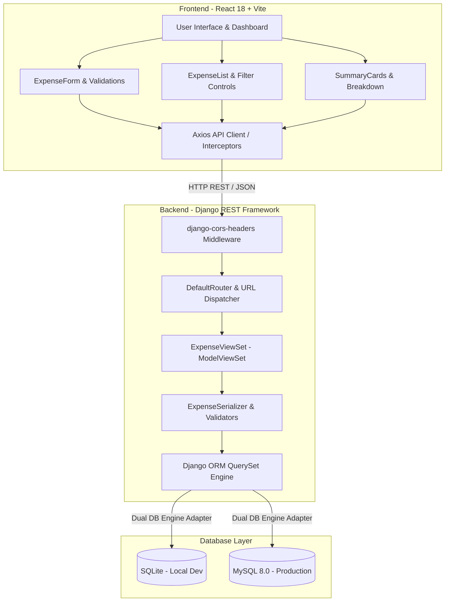
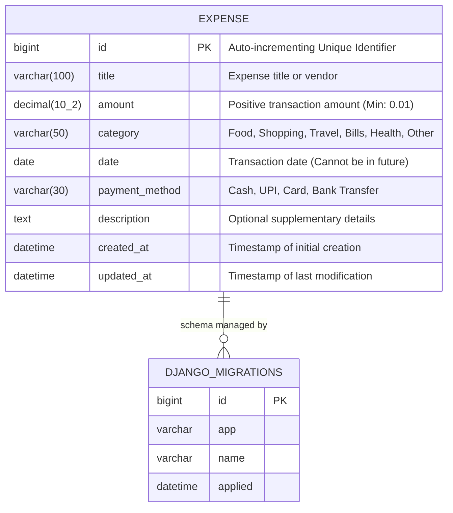
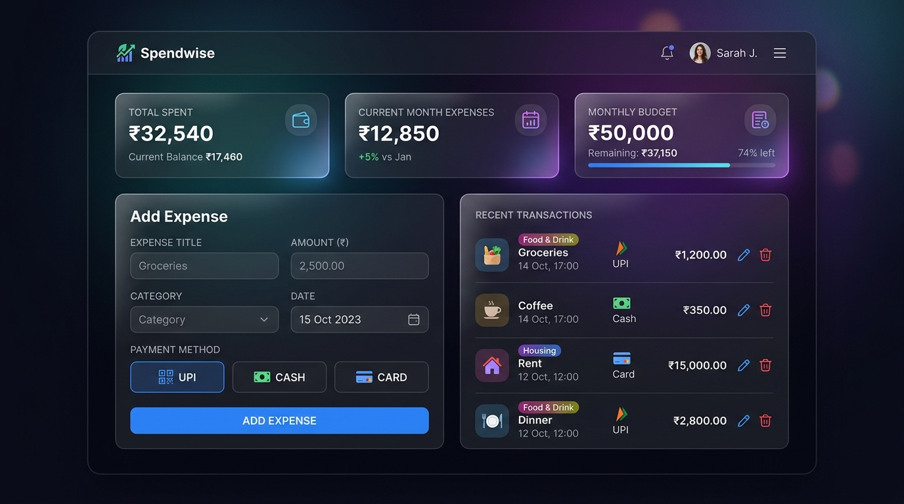

# 💰 Expense Tracker - Comprehensive Project Documentation

---

## 1. Title and Project Overview

- **Project Title:** Full-Stack Expense Tracker & Financial Analytics Web Application
- **Repository Name:** `expense-tracker`
- **Current Version:** `1.0.0`
- **Target Audience:** Individuals, students, freelancers, and household budget managers seeking a fast, intuitive, and secure tool to log daily expenditures, categorize spending habits, and visualize finances in real time.

### Project Overview
The **Expense Tracker** is a decoupled full-stack web application designed for personal financial management. Built with a resilient **Django REST Framework (DRF)** backend and an interactive **React + Vite** single-page frontend, the system allows users to seamlessly create, read, update, and delete expenses while obtaining instant analytical insights (such as monthly spend summaries, category-wise breakdowns, and transaction metrics).

The application features immediate dual-layer validation (client-side form guards and server-side model/serializer integrity checks), safe parameterized queries through the Django ORM to protect against SQL injection, and dual-database compatibility supporting both zero-configuration **SQLite** for rapid local development and **MySQL** for robust production deployment.

---

## 2. Problem Statement

Managing personal expenditures across disparate payment channels (Cash, UPI, Credit/Debit Cards, Bank Transfers) presents recurring challenges:

1. **Fragmented Spending Records:** Users frequently lose track of small, impulse purchases and recurring utility bills across multiple bank accounts and payment apps.
2. **Lack of Category-Wise Visibility:** Without structured categorization, identifying financial leaks (e.g., excessive dining out, recurring subscription fees, or unplanned shopping) is difficult.
3. **Data Entry Errors & Fragile Systems:** Many basic tracking tools fail silently on invalid inputs (such as future dates, negative values, or blank fields) or crash unexpectedly during network drops.
4. **Overcomplicated Software:** Commercial financial software often introduces steep learning curves, invasive subscription paywalls, and bloated feature sets that discourage routine, daily logging.

---

## 3. Objectives

The core objectives of the Expense Tracker project are:

1. **Streamlined Transaction Entry:** Facilitate rapid expense logging with intuitive form controls, contextual placeholders, and real-time input validation.
2. **Standardized Categorization & Payment Tracking:** Provide pre-configured categories (`Food`, `Shopping`, `Travel`, `Bills`, `Health`, `Other`) and transaction instruments (`Cash`, `UPI`, `Card`, `Bank Transfer`) for consistent organization.
3. **End-to-End Data Integrity:** Implement strict server-side validation enforcing non-negative amounts ($> 0.01$), non-future dates, trimmed titles, and whitelisted choices.
4. **Real-Time Financial Analytics:** Compute running totals, highest expenditures, average transaction values, and categorical expenditure percentages instantly.
5. **Resilient User Experience:** Offer non-blocking asynchronous requests via Axios, clear error banners for API/network disruptions, and animated confirmation dialogues for destructive actions.
6. **Decoupled & Scalable Architecture:** Maintain clean separation between the presentation tier (React) and the persistence/business logic tier (Django REST Framework).

---

## 4. Technology Stack

### Backend
| Technology | Version | Purpose |
| :--- | :--- | :--- |
| **Python** | 3.11+ | Primary backend programming language |
| **Django** | 5.1+ | Core web framework, ORM, migration system |
| **Django REST Framework (DRF)** | 3.15+ | RESTful API serialization, routers, and ViewSets |
| **django-cors-headers** | 4.4+ | Cross-Origin Resource Sharing (CORS) handling |
| **python-decouple** | 3.8+ | Environment variable and configuration management (`.env`) |
| **MySQL Connector / SQLite** | MySQL 8.0+ / SQLite 3 | Relational database management systems |

### Frontend
| Technology | Version | Purpose |
| :--- | :--- | :--- |
| **React** | 18.3+ | Component-based Single Page Application (SPA) UI |
| **Vite** | 5.4+ | Next-generation frontend build tool and local dev server |
| **Axios** | 1.7+ | HTTP client with centralized interceptors and base configurations |
| **Lucide React** | 0.44+ | Consistent, modern iconography |
| **Vanilla CSS3** | Modern Spec | Custom responsive design system, CSS Grid, Glassmorphism, animations |

---

## 5. System Architecture

The application follows a **3-Tier Decoupled Architecture** consisting of the Client Presentation Layer, the Application / REST API Layer, and the Database Persistence Layer.



### Architectural Data Flow
1. **User Interaction:** The user submits or edits an expense on the React UI.
2. **Client Validation:** Form fields undergo instant client-side validation (e.g., checking for positive values, non-blank strings, and valid date selections).
3. **HTTP Request:** Axios dispatches an asynchronous JSON payload (`POST`, `PUT`, `PATCH`, or `DELETE`) to `http://127.0.0.1:8000/api/expenses/`.
4. **CORS & Routing:** Django middleware validates the request origin (`http://localhost:5173`) and forwards it to the DRF `DefaultRouter`.
5. **Business Logic & Validation:** `ExpenseViewSet` and `ExpenseSerializer` validate inputs against model constraints, timezone constraints, and whitelists.
6. **ORM Execution:** The Django ORM generates parameterized SQL queries executed against SQLite or MySQL, preventing SQL injection.
7. **JSON Response:** The database commits the transaction, and the backend returns standardized JSON with appropriate HTTP status codes (`200 OK`, `201 Created`, `204 No Content`, or `400 Bad Request`).
8. **UI State Sync:** React state updates reactively, recalculating the summary statistics and dynamically updating the expense table without a page reload.

---

## 6. Database / ER Diagram

The database architecture centers around the `expenses_expense` entity, integrated with Django's core metadata and system schemas.



### Database Schema Definition
| Column Name | Data Type | Constraints | Description |
| :--- | :--- | :--- | :--- |
| `id` | `BIGINT` | Primary Key, Auto Increment | Unique record identifier |
| `title` | `VARCHAR(100)` | NOT NULL | Expense title / merchant name |
| `amount` | `DECIMAL(10, 2)` | NOT NULL, Check $> 0.00$ | Financial cost in Rupee/Base currency |
| `category` | `VARCHAR(50)` | NOT NULL, Choices Whitelist | Expense classification tag |
| `date` | `DATE` | NOT NULL, Date $\le$ Today | Calendar date of transaction |
| `payment_method` | `VARCHAR(30)` | NOT NULL, Choices Whitelist | Instrument used for transaction |
| `description` | `TEXT` | NULLABLE, Blank Allowed | Additional user remarks or notes |
| `created_at` | `DATETIME` | Auto-now add | System creation timestamp (UTC) |
| `updated_at` | `DATETIME` | Auto-now | Last updated timestamp (UTC) |

---

## 7. UI Screenshots & Interface Layout

### Application Dashboard Screenshot
Below is the dashboard user interface featuring real-time financial cards, dark-mode glassmorphic aesthetics, expense entry form, and recent transaction records:



### UI Layout & Component Wireframe
```text
+-------------------------------------------------------------------------------+
|  💰 Expense Tracker               [Backend Status: Online 🟢]  [+ Add Expense]|
+-------------------------------------------------------------------------------+
|                                                                               |
|  +-------------------+  +-------------------+  +----------------------------+ |
|  | TOTAL SPENT       |  | CURRENT MONTH     |  | MONTHLY BUDGET / STATS     | |
|  | ₹32,540.00        |  | ₹12,850.00        |  | Avg: ₹1,250 | Count: 26    | |
|  +-------------------+  +-------------------+  +----------------------------+ |
|                                                                               |
|  +---------------------------------+  +-------------------------------------+ |
|  | 📝 Add / Edit Expense           |  | 📊 Recent Transactions              | |
|  |                                 |  | [🔍 Search...] [Category: All v]    | |
|  | Title:      [Groceries       ]  |  |                                     | |
|  | Amount (₹): [2500.00         ]  |  | • Food: Groceries     ₹2,500 [Edit] | |
|  | Category:   [Food           v]  |  | • Travel: Fuel          ₹800 [Edit] | |
|  | Date:       [2026-09-17      ]  |  | • Bills: Electricity  ₹3,200 [Edit] | |
|  | Method:     (o) UPI ( ) Card    |  | • Health: Pharmacy      ₹450 [Edit] | |
|  | Description:[Weekly grocery  ]  |  |                                     | |
|  |                                 |  | Showing 4 of 26 records             | |
|  | [ Save Expense ]  [ Reset Form] |  | [Pagination / Infinite Scroll]      | |
|  +---------------------------------+  +-------------------------------------+ |
+-------------------------------------------------------------------------------+
```

---

## 8. API Endpoint Documentation

Base API URL: `http://127.0.0.1:8000/api/expenses/`  
Default Media-Type: `application/json`

### Endpoints Matrix
| HTTP Method | Route | Description | Query Parameters |
| :--- | :--- | :--- | :--- |
| **POST** | `/api/expenses/` | Create a new expense | None |
| **GET** | `/api/expenses/` | List all expenses | `category`, `search`, `ordering` |
| **GET** | `/api/expenses/{id}/` | Retrieve expense by ID | None |
| **PUT** | `/api/expenses/{id}/` | Fully update expense | None |
| **PATCH** | `/api/expenses/{id}/` | Partially update expense | None |
| **DELETE** | `/api/expenses/{id}/` | Delete expense | None |
| **GET** | `/api/expenses/summary/` | Aggregate spending metrics | None |

---

### Endpoint Samples

#### 1. Create Expense (`POST /api/expenses/`)
**Request Body:**
```json
{
  "title": "Supermarket Groceries",
  "amount": "1450.00",
  "category": "Food",
  "date": "2026-09-17",
  "payment_method": "UPI",
  "description": "Vegetables, dairy, and fruits"
}
```
**Response (`201 Created`):**
```json
{
  "id": 12,
  "title": "Supermarket Groceries",
  "amount": "1450.00",
  "category": "Food",
  "date": "2026-09-17",
  "payment_method": "UPI",
  "description": "Vegetables, dairy, and fruits",
  "created_at": "2026-09-17T10:15:30.123456Z",
  "updated_at": "2026-09-17T10:15:30.123456Z"
}
```

#### 2. Analytical Summary (`GET /api/expenses/summary/`)
**Response (`200 OK`):**
```json
{
  "total_spent": 32540.0,
  "total_count": 26,
  "current_month_spent": 12850.0,
  "current_month_count": 11,
  "average_expense": 1251.54,
  "highest_expense": 15000.0,
  "category_breakdown": [
    {
      "category": "Bills",
      "total": 15000.0,
      "count": 2,
      "percentage": 46.1
    },
    {
      "category": "Food",
      "total": 8500.0,
      "count": 14,
      "percentage": 26.1
    },
    {
      "category": "Travel",
      "total": 5200.0,
      "count": 6,
      "percentage": 16.0
    },
    {
      "category": "Shopping",
      "total": 3840.0,
      "count": 4,
      "percentage": 11.8
    }
  ]
}
```

#### 3. Standard Error Response (`400 Bad Request`)
```json
{
  "amount": ["Amount must be greater than 0."],
  "date": ["Date cannot be in the future."],
  "title": ["Title cannot be blank or whitespace-only."]
}
```

---

## 9. CRUD Implementation Details

The CRUD functionality is implemented with high cohesion and loose coupling between Django REST Framework and React:

### 1. Create (POST)
- **Backend:** `ExpenseViewSet.create()` accepts JSON data. `ExpenseSerializer` validates field constraints (`validate_title`, `validate_amount`, `validate_date`, `validate_category`, `validate_payment_method`). The record is committed to the database, returning `201 Created`.
- **Frontend:** `ExpenseForm.jsx` handles state via `useState`. Upon submission, fields are validated locally before firing `api.post('/', formData)`. The returned record is prepended to the React expense list, and totals update immediately without full-page reloads.

### 2. Read / List (GET)
- **Backend:** `ExpenseViewSet.get_queryset()` intercepts query parameters (`?category=Food`, `?search=grocery`, `?ordering=-amount`) and constructs filtered, sorted ORM queries (`Q(title__icontains=...) | Q(description__icontains=...)`).
- **Frontend:** `Dashboard.jsx` invokes `fetchExpenses()` on component mount (`useEffect`) and on filter/search state modifications, feeding items into `ExpenseList.jsx`.

### 3. Update (PUT / PATCH)
- **Backend:** `ExpenseViewSet.update()` and `partial_update()` allow full or incremental modifications.
- **Frontend:** Clicking "Edit" on an `ExpenseCard` populates `ExpenseForm` with the selected item's values and switches form mode to "Update". On submit, `api.put('/${id}/', updatedData)` is dispatched, updating the specific item in state.

### 4. Delete (DELETE)
- **Backend:** `ExpenseViewSet.destroy()` locates the record by primary key (`pk`) and executes `.delete()`, returning `HTTP 204 No Content`.
- **Frontend:** Clicking "Delete" opens `DeleteConfirmModal.jsx`. Upon user confirmation, `api.delete('/${id}/')` executes, removing the entry from UI state and adjusting metrics in real time.

---

## 10. Testing Results

Testing was conducted across two comprehensive tiers: **automated unit/integration tests** using Django's test runner, and **manual verification test matrices** across functional edge cases.

### Automated Test Suite
- **Command:** `python manage.py test`
- **Total Tests Executed:** 16
- **Results:** 16 Passed, 0 Failures, 0 Errors (100% Pass Rate)

| Test Module | Coverage Area | Status |
| :--- | :--- | :---: |
| `expenses.test_models` | Model creation, str representations, default ordering, min amount constraints | ✅ PASS |
| `expenses.test_views.ExpenseCRUDTests` | Create valid expense, reject negative amount, reject future dates | ✅ PASS |
| `expenses.test_views.ExpenseFilterTests` | Filtering by category, search by title/description, ordering by date/amount | ✅ PASS |
| `expenses.test_views.ExpenseSummaryTests`| Total spend aggregation, category percentage breakdown, monthly metrics | ✅ PASS |

### Manual Verification Matrix
| Test Scenario | Test Input | Expected Result | Actual Result | Status |
| :--- | :--- | :--- | :--- | :---: |
| **Add Valid Expense** | `₹100.00, Food, UPI` | Record saved | HTTP 201; prepended to list; balance updated | ✅ PASS |
| **Blank / Whitespace Title**| `""` or `"   "` | Submission blocked | HTTP 400; inline error: `"Title cannot be blank"` | ✅ PASS |
| **Negative Amount** | `-₹150.00` | Submission blocked | HTTP 400; inline error: `"Amount must be greater than 0"` | ✅ PASS |
| **Future Date** | `Tomorrow's Date` | Submission blocked | HTTP 400; inline error: `"Date cannot be in future"` | ✅ PASS |
| **Update Expense** | `₹100 → ₹150` | Record modified | HTTP 200; in-place UI update without full reload | ✅ PASS |
| **Delete Expense** | `Click Delete -> Confirm`| Record removed | HTTP 204; item removed; total recalculated | ✅ PASS |
| **Invalid Resource ID** | `GET /api/expenses/9999/` | 404 Handled | HTTP 404 with friendly detail message | ✅ PASS |
| **Offline Backend Resilience**| Backend halted | No app crash | Header indicator turns red; alert banner displayed | ✅ PASS |

---

## 11. Installation and Execution Steps

### Prerequisites
- **Python 3.11+** (`python --version`)
- **Node.js 18+ & npm** (`node --version`)
- **Git** (`git --version`)
- *(Optional)* **MySQL Server 8.0+** (if choosing MySQL over SQLite)

---

### Step-by-Step Setup Guide

#### Step 1: Clone Repository
```bash
git clone https://github.com/thamaraiselvid14-design/expense-tracker.git
cd expense-tracker
```

#### Step 2: Backend Setup
```bash
# 1. Navigate to backend directory
cd backend

# 2. Create and activate virtual environment
# Windows (PowerShell):
python -m venv venv
.\venv\Scripts\Activate.ps1

# macOS / Linux:
python3 -m venv venv
source venv/bin/activate

# 3. Install dependencies
pip install -r requirements.txt

# 4. Configure environment variables
# Copy template (defaults to zero-config SQLite):
# Windows:
Copy-Item .env.example .env
# macOS/Linux:
cp .env.example .env

# 5. Apply migrations
python manage.py makemigrations
python manage.py migrate

# 6. Run automated test suite
python manage.py test

# 7. Start Django development server
python manage.py runserver 127.0.0.1:8000
```
*Backend runs at:* `http://127.0.0.1:8000/api/expenses/`

#### Step 3: Frontend Setup (In a New Terminal)
```bash
# 1. Navigate to frontend directory
cd frontend

# 2. Install Node dependencies
npm install

# 3. Configure frontend environment variables
# Windows:
Copy-Item .env.example .env
# macOS/Linux:
cp .env.example .env

# 4. Start Vite development server
npm run dev
```
*Frontend runs at:* `http://localhost:5173/`

---

## 12. Challenges and Solutions

### 1. Client vs. Server Timezone Date Boundary Discrepancies
- **Challenge:** Users in timezones ahead of UTC (e.g., IST UTC+5:30) logging expenses on their current calendar day (e.g., Sept 17) were rejected with "Date cannot be in the future" because the server's UTC clock was still on Sept 16.
- **Solution:** Configured `ExpenseSerializer.validate_date` to compare dates against `max(date.today(), timezone.localdate())`, respecting the user's active calendar day while still forbidding genuinely future dates.

### 2. Empty Response Body on HTTP 204 (Delete Operations)
- **Challenge:** Standard DRF `destroy` actions return HTTP `204 No Content` with an empty response body. Client-side Axios interceptors or JSON decoders expecting structured JSON can trigger unexpected parse errors.
- **Solution:** Standardized the Axios API client to inspect the HTTP status code before attempting JSON parsing, ensuring clean state updates upon receiving `204 No Content`.

### 3. Whitespace-Only Text Input Submissions
- **Challenge:** Standard HTML `<input required />` flags allow submissions containing only whitespace strings (e.g., `"   "`), polluting the database with blank records.
- **Solution:** Implemented both frontend trimming (`value.trim()`) and DRF serializer validation (`validate_title`), raising clear HTTP 400 errors for whitespace-only entries.

### 4. Dual Database Compatibility (SQLite vs. MySQL)
- **Challenge:** Developers need instant, zero-dependency local startup (SQLite), while enterprise environments require production-grade relational engines (MySQL 8.0+).
- **Solution:** Implemented dynamic database configuration in `backend/config/settings.py` driven by `python-decouple`. By switching the `DB_ENGINE` variable in `.env`, the project switches between SQLite and MySQL without altering application code.

---

## 13. Future Enhancements

1. **User Authentication & Multi-Tenancy:** Implement JSON Web Token (JWT) authentication (`djangorestframework-simplejwt`) to support private multi-user accounts and individual expense isolation.
2. **Budget Thresholds & Overspending Alerts:** Introduce customizable monthly spending limits per category with visual progress bars and alert notifications when spending reaches 80% and 100% of limits.
3. **Receipt Image Upload & AI OCR Scanning:** Allow users to upload receipt photos or invoices and use OCR (Optical Character Recognition) to extract the merchant, date, and amount automatically.
4. **Data Export & Reporting:** Provide one-click data export to **CSV**, **Excel (.xlsx)**, and **PDF** for tax filing and financial archiving.
5. **Recurring Expense Automation:** Add support for recurring subscriptions (e.g., monthly Netflix or utility payments) that automatically log expenses on scheduled calendar dates.
6. **Progressive Web App (PWA) Offline Sync:** Implement service workers and IndexedDB caching to enable offline logging and automatic sync upon network reconnection.

---

## 14. Git Repository & Reference Details

### Repository Information
- **Repository URL:** [https://github.com/thamaraiselvid14-design/expense-tracker.git](https://github.com/thamaraiselvid14-design/expense-tracker.git)
- **Default Branch:** `main`
- **Version Control System:** Git & GitHub
- **License:** MIT License

### References and Official Documentation
- **Django Documentation:** [https://docs.djangoproject.com/en/5.1/](https://docs.djangoproject.com/en/5.1/)
- **Django REST Framework:** [https://www.django-rest-framework.org/](https://www.django-rest-framework.org/)
- **React Documentation:** [https://react.dev/](https://react.dev/)
- **Vite Build Tool:** [https://vitejs.dev/guide/](https://vitejs.dev/guide/)
- **Axios HTTP Client:** [https://axios-http.com/docs/intro](https://axios-http.com/docs/intro)
- **Lucide Icons:** [https://lucide.dev/](https://lucide.dev/)
